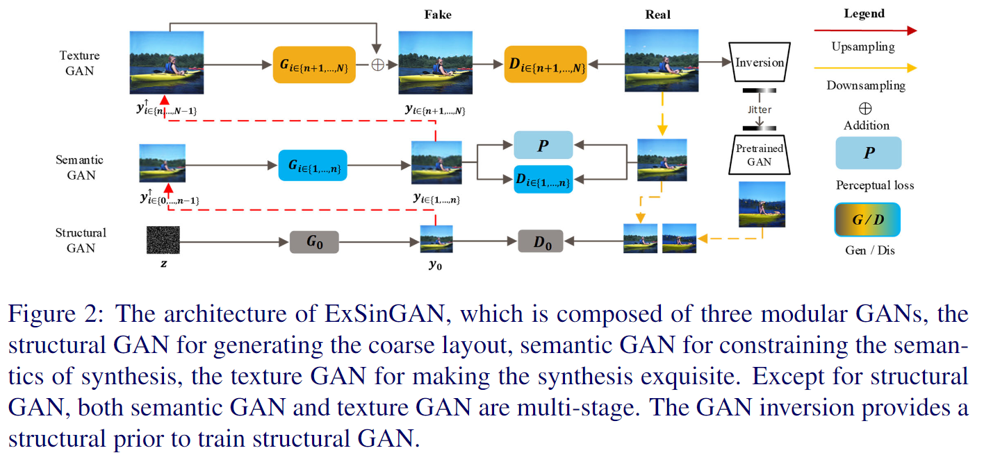
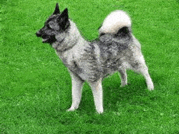
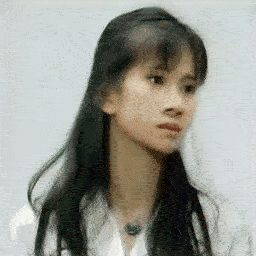

# ExSinGAN

### Pytorch implementation of the paper: : "ExSinGAN: learning an explainable Generative Model from a Single Image (BMVC 2021)"


## code
Our code refered to the following projects:
* [SinGAN: https://github.com/tamarott/SinGAN](https://github.com/tamarott/SinGAN)
* [DGP: https://github.com/XingangPan/deep-generative-prior](https://github.com/XingangPan/deep-generative-prior)

And we rewrited the SinGAN and DGP for more concise expression.

### Download pre-trained models
Please download Pretrained VGG and BigGAN from [Google drive](https://drive.google.com/drive/folders/1PCjfGss6Ewc9AeZN3gey3ZSHPPHlgTGM?usp=sharing), and put them to `Pretrained` folder.

### Install dependencies

```angular2html
pip install -r requirements.txt
```

###  Train
To train ExSinGAN, just running
```
python main_train.py --input_dir <input_dir> --input_name <image>
```
*e.g.*, if you has an image `leaningtower.jpg` in `Input/Images`, just run 


```
python main_train.py --input_dir Input/Images --input_name leaningtower.jpg
```
For more details of parameters, please see `Models/config.py`

We also offered a script To train SinGAN, just running
```angular2html
python main_train.py --input_dir <input_dir> --input_name <image> --use_struct False --use_semantic False --rescale_method singan --pyramid_height None
```


###  Random samples

Once the model is trained completely, the syntheses are stored in the `Output` directory. You can sample more syntheses by running 
```angular2html
python random_samples.py --model_path <model_path> --num <num>
```

[comment]: <> (###  Random samples of arbitrary sizes)

[comment]: <> (For generating samples of arbitrary sizes, running)

[comment]: <> (```angular2html)

[comment]: <> (python random_samples.py --model_path <model_path> --num <num> --scale_h <scale_h> --scale_w <scale_w>)

[comment]: <> (```)
